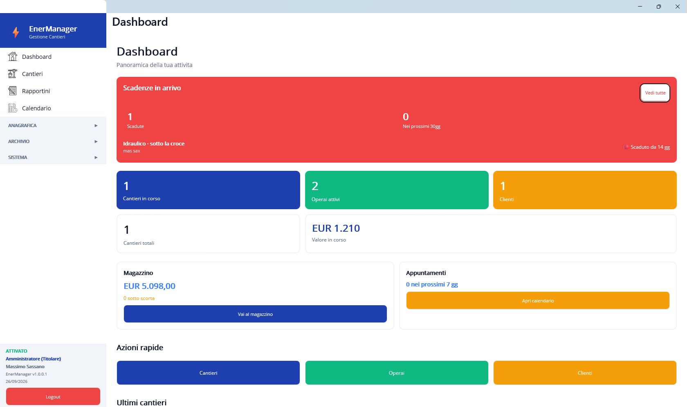
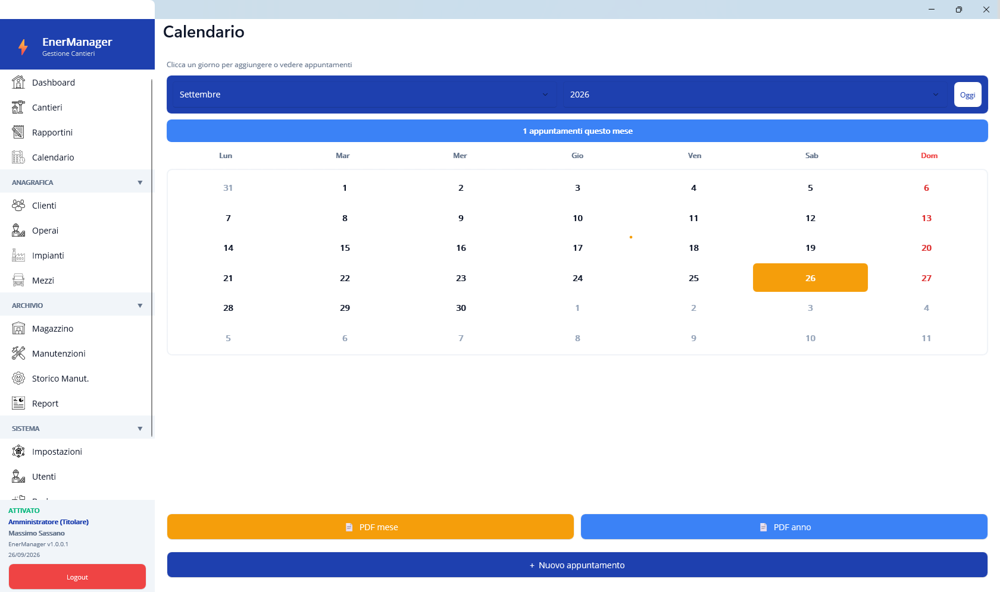
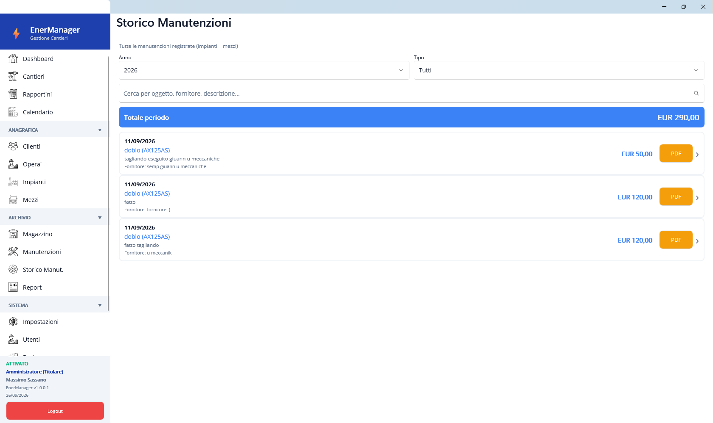
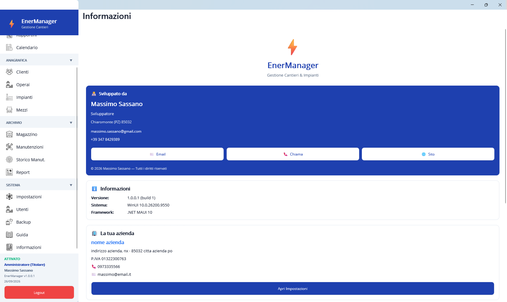

# ⚡ EnerManager

**Gestione cantieri, impianti e manutenzioni per piccole aziende di elettricisti.**

App desktop Windows, leggera e completa. Funziona **offline**: tutti i dati restano sul tuo PC in un database locale. Niente cloud, niente abbonamenti mensili.

<table align="center">
  <tr>
    <td align="center">
       
      Schermata principale
    </td>
    <td align="center">
       
      Calendario
    </td>
  </tr>
  <tr>
    <td align="center">
       
      Storico
    </td>
    <td align="center">
       
      Info
    </td>
  </tr>
</table>

---

## 📥 Download

Vai nella sezione [**Releases**](../../releases) e scarica l'ultima versione:

- **EnerManager_vX.X.X.zip** → contiene `EnerManager.exe` + dipendenze
- Scompatta lo zip in una cartella a piacere (es. `C:\EnerManager\`)
- Doppio click su `EnerManager.exe` per avviare

**Requisiti:** Windows 10 (build 1809+) o Windows 11, 64 bit.

---

## ✨ Funzionalità

- **Anagrafica completa**: clienti, operai, cantieri, impianti, mezzi
- **Rapportini giornalieri** con operai, ore e voci di spesa
- **Manutenzioni programmate** per impianti e mezzi con scadenze automatiche
- **Magazzino** con carico/scarico materiali e soglia di riordino
- **Calendario** appuntamenti mensile con export PDF
- **Foto cantiere** con galleria e scatto da fotocamera
- **Report** aggregati per cantiere / cliente / operaio
- **PDF professionali** per ogni entità (con logo aziendale)
- **Email e condivisione** dirette di ogni PDF
- **Backup** in un unico file ZIP (DB + PDF + logo)
- **Multiutente** con permessi per singolo utente (menu visibili)
- **Guida integrata** + manuale in PDF
- **Interfaccia in italiano**

---

## 🔑 Licenza

EnerManager è **software commerciale**.

- **Prova gratuita di 7 giorni** — parte automaticamente al primo avvio
- **Licenza attivata** — illimitata, sbloccata tramite **seriale**

### Come ottenere un seriale

Il seriale è **legato alla tua Partita IVA** e viene generato su richiesta.

👉 **Apri una [Issue](../../issues)** con oggetto `Richiesta seriale EnerManager` e indica:
- Nome azienda
- Partita IVA
- Città

Ti verrà inviato il seriale per l'attivazione.

### Come attivare

1. Compila la **Partita IVA** in *Impostazioni*
2. Vai in *Impostazioni → sezione Licenza*
3. Incolla il seriale (formato `XXXXX-XXXXX-XXXXX-XXXXX`)
4. Premi **Attiva EnerManager**

Se la prova è già scaduta, all'avvio appare la schermata *Prova scaduta* dove puoi attivare subito.

---

## 🖼️ Screenshot

*(in arrivo)*

---

## ❓ Supporto

Per problemi, domande o richieste:

- 🐛 **Bug / problemi** → apri una [Issue](../../issues)
- ✉️ **Richieste commerciali** → apri una Issue con oggetto `[Commerciale]`
- 💡 **Suggerimenti** → apri una Issue con oggetto `[Idea]`

---

## 📝 Changelog

### v1.0.0.1 (2026)
- Prima release pubblica
- Trial 7 giorni + attivazione con seriale
- Anagrafica completa (clienti, cantieri, operai, impianti, mezzi, materiali)
- Rapportini, manutenzioni, calendario, report
- Generazione PDF con logo aziendale per ogni entità
- Email + share diretto dei PDF
- Backup ZIP completo
- Multiutente con permessi per singolo utente
- Guida integrata + manuale PDF
- Portable .exe (nessuna installazione richiesta)

---

## © Copyright

© 2026 Massimo Sassano — Tutti i diritti riservati.

Il software è proprietario. Il codice sorgente non è pubblico.
Il presente repository contiene **solo documentazione e release binarie**.
